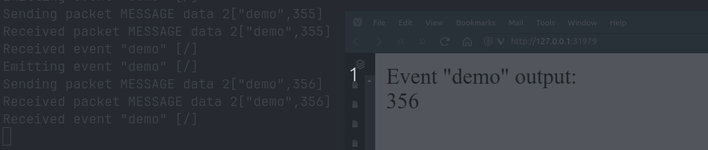

## Configuring and most dependency management

Start with a clean environment (in `./.venv`) and mostly use `edwh setup` or `invoke setup` if you don't use our edwh
tool.
You might need to pip install either, probably `pip install pyinvoke`.

## Starting

1. run the server using `./sioserver.py`, open the browser on `http://127.0.0.1:31979` to start the js client.
1. `invoke demo-final` starts the `demo_final` task from tasks.py to spawn dummy demo events
2. `./test_client.py` starts the 'regular' test client.
3. `./test_simpleclient.py` starts the simple test client... 

## Starting something more useful. 
The recording and translation part doesn't use the socketio at the moment. Notyet. 
So here's my poor-mans choice for getting inter process communication working without async, threads and all that. 
I mean, this is basically still single-direction pipes you know!

```shell
$ ew local.stream | ew local.translate
```
All hail the `lineinput` module and `sys.stdout.flush()`. 


## What i didn't know:
> **broadcasting to other clients is restricted to `server` emits only.**

That means that if client A emits something for client B, the server MUST re-emit that message. Since you will normally not receive your own messages (excluded in the server argument list), you can simply re-emit it. 

```python
@sio.on("demo")
async def demo_rebroadcaster(sid, data):
    logger.info(f"!> DEMO HANDLER@{sid} {data!r}")
    await sio.emit('demo', data)

@sio.on("*")
async def catch_all_rebroadcaster(event, sid, data):
    logger.info(f"!> CATCHALL HANDLER {event!r}@{sid} {data!r}")
    await sio.emit(event, data)
```
That also explains why the `sio.emit` is _way_ more capable on the server than on the clients. 
Like the callback stuff, the to field etc. 

## Other stuff that bit me

1. Because the signature of `sio` is so similar when using `async` and synchronous code, i forgot the `async` keyword. Without extended logging, you will not get an error, and be silently ignored. 
2. argument order, sometimes you get a sid (on the server) but not on the clients. So mind your arguments that different for the same event from server to client. 
3. version handling. the pypi page of the `python-socketio` packages explains which versions should work together.
4. You don't receive your own sent events. (this is useful, but it did crawl into my brain as something that *might* occur)


## The beauty

Here's the most deadsimple client:
```python
#!.venv/bin/python3
import socketio

with socketio.SimpleClient(ssl_verify=False, logger=True, engineio_logger=True) as sio:
    sio.connect('http://127.0.0.1:31979')
    while True:
        event = sio.receive()
        print(f"simple!> {event!r}")

```

Here's a simple task that sends messags:
```python
@task
def demo_final(c:Context):
    import socketio
    with socketio.SimpleClient(ssl_verify=False, logger=True, engineio_logger=True) as sio:
        sio.connect('http://127.0.0.1:31979')
        cnt = 1356
        while True:
            cnt += 111
            sio.emit('demo',cnt)
            time.sleep(2)
```

Now for the simplicity of a complete server:

```python

#!.venv/bin/python3
import os
import uvicorn
import socketio
import logging

logging.basicConfig(
    level=logging.DEBUG, format="%(asctime)s %(levelname)s %(name)s: %(message)s", datefmt="%Y-%m-%d %H:%M:%S"
)

logger = logging.getLogger(__name__)
PORT = int(os.getenv("SIO_PORT", 31979))
HOST = os.getenv("SIO_HOST", "127.0.0.1")
SERV_APP_FILE = "sioserver:app"
logger.debug(f"===: {SERV_APP_FILE}")

sio = socketio.AsyncServer(
    async_mode="asgi",
    cors_allowed_origins="*",
    SameSite=None,
    logger=True,
    engineio_logger=True,
)

app = socketio.ASGIApp(sio, static_files={"/": "./index.html", '/sio.js':'./sio.js/'})

@sio.on("demo")
async def demo(sid, data):
    logger.info(f"!> DEMO HANDLER@{sid} {data!r}")
    # forward to all connected listeners
    await sio.emit('demo', data) # /!\ this is async code, await the emit!

@sio.on("*")
async def collect_finals(event, sid, data):
    logger.info(f"!> CATCHALL HANDLER {event!r}@{sid} {data!r}")
    # forward to all connected listeners
    await sio.emit(event, data) # /!\ this is async code, await the emit!

if __name__ == "__main__":
    uvicorn.run(
        app=SERV_APP_FILE,
        host=HOST,
        port=PORT,
        reload=True,
        workers=1,
    )
```

And the better synchronous client, that's very easy to rewrite to async (see the server part above and _mind_ the `async` and `awaits`)
```python
#!.venv/bin/python3
import socketio
sio = socketio.Client(ssl_verify=False, logger=True, engineio_logger=True)
sio.connect('http://127.0.0.1:31979')

@sio.event
def connect():
    print('connection established')
    # sio.emit('test', {'data': 'some data'})


@sio.on('demo')
def test(data):
    print(f"!> DEMO@{sio.sid} {data!r}")


@sio.on("*")
def catch_all(event, namespace, sid, data):
    print(f"!> CATCH ALL ns:{namespace} {event!r}@{sid} {data!r}")

@sio.event
def disconnect():
    print('disconnected from server')


while True:
    sio.wait()

```

The most basic HTML client is as follows:
```html
<!DOCTYPE html>
<html>
<head>
    <title>Socket.IO Test</title>
    <script src="http://127.0.0.1:31979/sio.js/socket.io.js"></script>
    <script>
        document.addEventListener("DOMContentLoaded", function () {
            let socket = io.connect("http://127.0.0.1:31979");
            console.log('listening');
            socket.on("final", function (data) {
                console.log('final received');
                document.getElementById("finalEvent").innerText = data;
            });
            socket.on("demo", function (data) {
                console.log('demo received');
                document.getElementById("finalEvent").innerText = data;
            });
        });
    </script>
</head>
<body>
Event "demo" output:
<div id="finalEvent">will be overwritten</div>
</body>
</html>
```